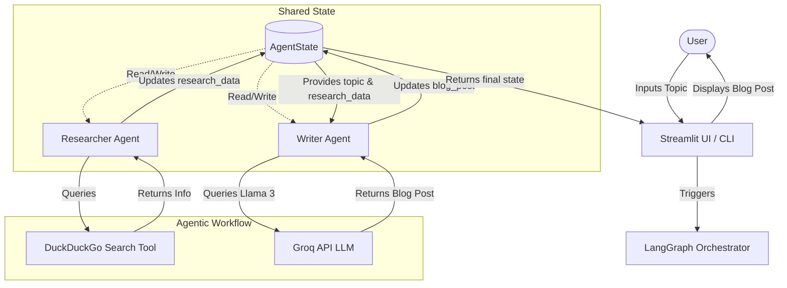
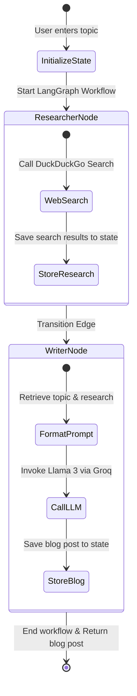

# AI Multi-Agent Blog Generator

An Agentic AI application built using **LangGraph**, **LangChain**, and **Streamlit** that demonstrates how multiple specialized AI agents can collaborate to perform research and write comprehensive blog posts using the **Groq API** (Llama 3).

---

## 🌟 Badges

[](https://www.python.org/)
[](https://github.com/langchain-ai/langgraph)
[](https://groq.com/)
[](https://streamlit.io/)
[](https://opensource.org/licenses/MIT)

---

## 📝 Project Description

The **AI Multi-Agent Blog Generator** is an Agentic AI application designed to showcase agent collaboration. Rather than relying on a single large language model (LLM) prompt to perform research and write content, this application breaks the task down into two specialized agent nodes: a **Researcher Agent** and a **Writer Agent**.

- The **Researcher Agent** searches the web using DuckDuckGo to gather current information and insights.
- The **Writer Agent** consumes this research from the shared state memory and synthesizes a structured, engaging blog post using Llama 3 running on Groq.
- **LangGraph** orchestrates the sequence, ensuring smooth state updates and data flow between nodes.

---

## ✨ Features

- **Multi-Agent Orchestration**: Managed workflow execution using LangGraph `StateGraph`.
- **Shared State Memory**: Local memory memory-bank (`AgentState`) allowing agents to read and append data seamlessly.
- **DuckDuckGo Web Search**: Live search queries to pull up-to-date resources.
- **Groq API Acceleration**: Generates high-quality markdown blogs rapidly utilizing Llama 3.
- **Streamlit Web UI**: Responsive, beautiful dark-themed dashboard designed like a professional SaaS application.
- **CLI Mode**: Simple CLI entrypoint for running directly from the terminal.
- **Downloadable Output**: Allows users to export the generated blog post as a markdown file.

---

## 🏗️ System Architecture



---

## 🔄 Workflow Diagram



---

## 📁 Folder Structure

```text
AI-Multi-Agent-Blog-Generator/
├── .streamlit/
│   └── config.toml          # Streamlit UI theme settings
├── agents/
│   ├── researcher.py        # Researcher Agent node logic
│   └── writer.py            # Writer Agent node logic
├── config/
│   └── groq_config.py       # Groq API and LLM setup
├── graph/
│   └── workflow.py          # LangGraph StateGraph compilation
├── prompts/
│   └── writer_prompt.py     # Prompt template for blog generator
├── state/
│   └── agent_state.py       # Shared AgentState definition
├── tools/
│   └── search_tool.py       # Web search tool integration
├── .env                     # Environmental configurations (Git ignored)
├── .gitignore               # Git ignored file patterns
├── app.py                   # Streamlit web application interface
├── main.py                  # CLI application entrypoint
├── requirements.txt         # Project python dependencies
└── README.md                # Project documentation
```

---

## 🛠️ Technologies Used

- **Python**: Core programming language.
- **LangGraph**: Framework for building stateful, multi-actor applications with LLMs.
- **LangChain**: AI orchestration and wrapper tools.
- **Groq API**: Interface for accessing ultra-fast Llama 3 models.
- **DuckDuckGo Search**: Web search package for dynamic data retrieval.
- **Streamlit**: Light-weight library for building rapid, interactive web dashboards.
- **python-dotenv**: Loads environmental configurations from local `.env` files.

---

## 🚀 Installation Guide

### Prerequisites
Make sure you have **Python 3.9+** and `pip` installed on your system.

### Steps
1. **Clone the Repository**:
   ```bash
   git clone https://github.com/prakashkmb12-afk/AI-Multi-Agent-Blog-Generator.git
   cd AI-Multi-Agent-Blog-Generator
   ```

2. **Create a Virtual Environment**:
   - On Windows:
     ```bash
     python -m venv venv
     venv\Scripts\activate
     ```
   - On macOS/Linux:
     ```bash
     python3 -m venv venv
     source venv/bin/activate
     ```

3. **Install Dependencies**:
   ```bash
   pip install -r requirements.txt
   ```

4. **Configure Environment Variables**:
   Create a `.env` file in the root directory and add your Groq API key:
   ```env
   GROQ_API_KEY=your_groq_api_key_here
   ```

---

## ⚙️ Environment Variables (`.env`)

```env
# Get your API key from: https://console.groq.com/
GROQ_API_KEY=gsk_your_actual_groq_api_key_goes_here
```

---

## 🎮 How to Run the Project

### Running the CLI Application
To run the project inside the console/terminal:
```bash
python main.py
```
You will be prompted to enter a topic, and the generated blog post will print directly in your terminal and save as a local `.md` file.

### Running the Streamlit Web UI
To run the modern, interactive dark-themed dashboard:
```bash
streamlit run app.py
```
This will start a local web server (usually at `http://localhost:8501`) and automatically open the application in your default web browser.

---

## 📥 Example Input

```text
The Future of AI Agents
```

---

## 📤 Example Output

```markdown
# The Future of AI Agents: Unlocking the Next Frontier of Artificial Intelligence

As artificial intelligence (AI) continues to transform industries and revolutionize the way we live and work, the concept of AI agents has emerged as a crucial component of this technological advancement...

### Key Characteristics of Future AI Agents
- **Increased Autonomy**: Future AI agents will operate with greater autonomy, making decisions and taking actions without constant human intervention.
- **Human-Like Reasoning**: Natural language comprehension and contextual memory allow agents to coordinate on a human level.
- **Decentralized Coordination**: Multiple agents collaborating via shared states to solve complex business logic.

...
```

---

## 💡 How the Multi-Agent Workflow Works

1. **State Initialization**: The user inputs a topic which initializes the `AgentState`.
2. **Researcher Phase**: LangGraph routes the execution to the `researcher` node. The Researcher Agent queries DuckDuckGo for the top 5 text results and saves them under the `research_data` field in `AgentState`.
3. **Writer Phase**: LangGraph routes the execution to the `writer` node. The Writer Agent reads the topic and research data, constructs a detailed prompt using the writer template, queries the Llama 3 model on Groq, and updates `blog_post` in the `AgentState`.
4. **Completion**: The graph execution transitions to `END`, and the final blog post is returned and displayed.

---

## 👥 Agent Responsibilities

| Agent | Input | Tool Used | Responsibility | Output |
| :--- | :--- | :--- | :--- | :--- |
| **Researcher Agent** | Topic (str) | DuckDuckGo Search | Searches the web, parses snippets, gathers context. | `research_data` (str) |
| **Writer Agent** | Topic & Research Data | Groq LLM (Llama 3) | Formats structure, synthesizes research, writes blog post. | `blog_post` (str) |

---

## 🧠 Shared State Explanation

In LangGraph, agents communicate through a **Shared State**. The state is defined as a `TypedDict` containing:
```python
class AgentState(TypedDict):
    topic: str          # User input topic
    research_data: str  # Context saved by Researcher Agent
    blog_post: str      # Finished article saved by Writer Agent
```
Every agent node acts as a function that receives this state, performs its execution, and returns a dictionary with the key(s) it wishes to update in the state.

---

## 🔮 Future Improvements

- **SEO Optimization Node**: An SEO Agent to audit keywords, headings, and metadata.
- **Fact-Checker Agent**: Validates claims in the generated blog post against reputable sources.
- **Reviewer Agent**: Critiques readability, tone, and grammar.
- **Image Generation Node**: Recommends or generates header images for the blog post.

---

## 🖼️ Screenshots

<details>
<summary>Click to view screenshots</summary>

*Placeholder: Screen captures of the CLI run and Streamlit Dark dashboard will be added here.*

</details>

---

## 🎓 Learning Outcomes

By building or exploring this project, you will understand:
- The fundamental principles of Agentic AI and multi-agent systems.
- How to orchestrate agent transitions using LangGraph.
- Working with shared states to enable collaboration.
- Connecting external tools (like Web Search) to LLM chains.
- Designing lightweight, modular web interfaces using Streamlit.

---

## 🤝 Contributing

Contributions are welcome! Please follow these steps:
1. Fork the project.
2. Create your feature branch (`git checkout -b feature/AmazingFeature`).
3. Commit your changes (`git commit -m 'Add some AmazingFeature'`).
4. Push to the branch (`git push origin feature/AmazingFeature`).
5. Open a Pull Request.

---

## 📄 License

This project is licensed under the MIT License - see the [LICENSE](LICENSE) file for details.

---

## ✍️ Author

- **prakashkmb12-afk**
- [GitHub Profile](https://github.com/prakashkmb12-afk)
